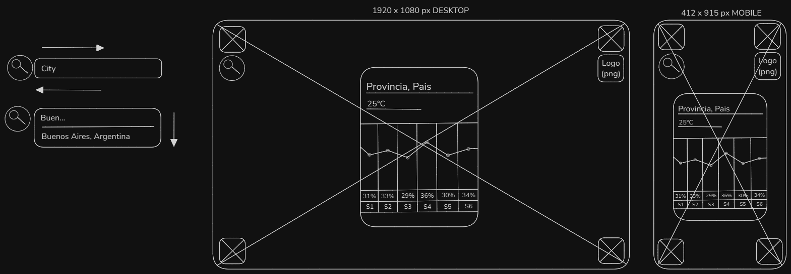

# AgroSpot

## Integrantes

-   **Cima Nancy Lucia**
-   **Ledesma Maximiliano Javier**
-   **Martearena Matias**

## Tema

**AgroSpot** es una plataforma innovadora diseñada para optimizar la gestión de recursos y datos en el sector agrícola.

Nuestro objetivo es proporcionar a los agricultores y empresas del sector agropecuario una herramienta eficiente para monitorear, analizar y mejorar sus operaciones diarias.

## Teoría Introductiva

La agricultura moderna enfrenta desafíos significativos en términos de eficiencia, sostenibilidad y toma de decisiones basadas en datos.

**AgroSpot** surge como una solución tecnológica que integra diversas fuentes de datos y ofrece análisis avanzados para mejorar la productividad agrícola.

Utilizando tecnologías de vanguardia, combinamos datos en tiempo real con análisis predictivo para ofrecer a los usuarios insights valiosos y personalizables.

## Tecnologías y Bibliotecas

### Frontend

-   **TypeScript** con **React** y **Vite**: Para la construcción de una interfaz de usuario robusta, eficiente y mantenible.
-   **Tailwind CSS** y **Tailwind Components**: Para un diseño moderno y responsive, facilitando el desarrollo de componentes reutilizables.
-   **Axios**: Para manejar las solicitudes HTTP y facilitar la comunicación con el backend.

### Backend

-   **Java** con **Spring Boot**: Para una arquitectura backend escalable, segura y bien estructurada.
-   **Base de datos NoSQL MongoDB**: Para almacenar y gestionar grandes volúmenes de datos no estructurados de manera eficiente.

### Análisis de Datos

-   **Python**: Para realizar análisis de datos avanzados, incluyendo procesamiento de datos, modelado predictivo y visualización.

## Elección de las Tecnologías

Elegimos **TypeScript** y **React** debido a su capacidad para mejorar la escalabilidad y mantenibilidad del código en proyectos grandes, junto con **Vite** que ofrece un entorno de desarrollo rápido y eficiente.

**Tailwind CSS** y **Tailwind Components** nos permiten mantener una consistencia en el diseño y acelerar el desarrollo del frontend.

Para el backend, **Java con Spring Boot** fue seleccionado por su solidez, seguridad y soporte en aplicaciones empresariales, mientras que **MongoDB** proporciona flexibilidad y rendimiento al manejar datos no estructurados, algo común en el sector agrícola.

Finalmente, **Python** es ideal para el análisis de datos, dado su amplio ecosistema de bibliotecas para análisis y visualización, lo que nos permite convertir datos en información útil para los usuarios.

## Wireframe y Diseño

-   **Wireframe a mano**: Hemos comenzado nuestro proceso de diseño creando wireframes a mano, lo que nos permitió iterar rápidamente sobre diferentes ideas y conceptos de la interfaz de usuario.

-   **Diseño en Figma**: Luego, trasladamos nuestros wireframes a figma para obtener un diseño más pulido y profesional, permitiendo visualizar mejor la disposición de los elementos y la experiencia del usuario.

